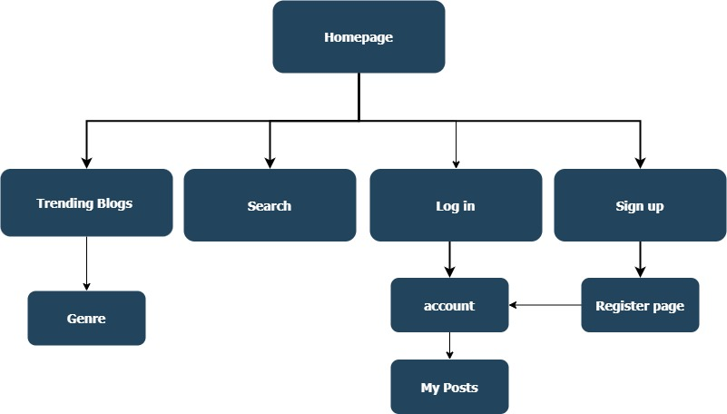

## Client-side experience
#### Due Feb 11, 11:59pm

### Layout document (Planned layout of your page in hardcopy/electronic copy showing elements, sizes, and placement – this is the plan for what your site will look like)
Layout of what we have so far

Home/ Landing Page

Upon entering the current prototype, users are immediately directed to the home page. Presently, the nav bar is the only feature displayed. As our development progresses, we will aim to fill the empty space with content such as images and text that offers an overview of the application’s purpose and functionalities. This would ideally provide users with a clear understanding of how to use the app. 

Trending Blogs Page

When a user navigates to the “Trending Blogs” section in the navigation bar, they will be directed to the trending blogs page that showcases the most popular blog posts on our app. These posts will likely be arranged based on metrics such as likes or views, as we continue to develop the functionality of the platform. Each post is enclosed within an article tag, containing different elements such as buttons, images, text, and so on. 

Search page

Users will also have the option to explore the search page where currently there is a simple search bar on display. As we continue to build the platform, the page will be used as a tool that enables users to find specific items, such as bloggers, with ease. Search results will likely be sorted by relevance, and will be displayed to the user once they enter what they wish to search for. Users will also eventually be able to interact with the search results accordingly. 

Log in

A staple for almost any online service, this will be the first thing seen by almost every user upon entering the site. With the brief interaction and minimal user input, this doesn’t need to be flashy. At its most basic level, all that it needs is an input for username and password as well as the physical “log in” button. This can be taken a step further through the addition of visuals surrounding it, whether that be banners relating to the blog’s contents or ad space to be given out for site revenue.

Sign In

The login page with extra features to get the bare minimum details from the user to create an account. Needing a username, email, and confirmed password is all that is required at this step as further details can be added in the profile page as the user sees fit. In reality users only visit this page once, but for continuity’s sake its design and overall feel should be similar if not identical to that of the login page.

### Organization of pages (How are pages linked? – site map)

### Logic process (How will a user engage with site?): This needs to include all processes for how the user/admin will engage site.
##### User Engagement 
1. Visiting the Website
    - Users access the website by entering the URL in their web browser or clicking on a link.
    - The homepage or landing page is displayed.
2. Navigation:
    - users can click on the header items, Trending Blogs, Search, Log In, Sign up and other buttons to be added like account info and perhaps a home page, that recomends items
3. Reading Content:
    - Users can read the content displaed, they can view imagess
4. Interacting with the content
    - Users that have an account and are logged in can leave comments on blogs, like, share, follow the content creator.
    - features like saving may beacome avalible
5. Searching
    - users can use the search bar to seaarch for specific items they wish to look at.
    - searches are based on relavence.
6. User accounts
    - users can create accounts to allow themselves to enage with the blogs.
    - account features will allow following, comments, posting, etc..
##### Administrator engagement
1. Content Canagement
    - Admin can delete, hide or edit posts.
    - Admin can manage content displayed
2. User Management
    - Admin can manage accounts, depending on the issues at hand.
3. Security 
    - Admin inplements security to allow user information to be secure.
4. Backups
    - Admin will have regular backups to ensure content is up to date and secure.
5. Features
    - Admin will implement new features.
    - Admin will imporve user experiences based on user feedback

### Discussion regarding the design and styles of all pages
### Develop the pages with client-side validation
- This has been done!
### Develop styles for pages
- Somewhat done, needs to be changed if the other group members want
### Examples of each page type in your proposed site
### Include a link to your GitHub repo showing the pages you have developed so far in your submission document. Remember to add me and the TAs (iadaji, iyanushow, Marium-E-Jannat, vic-ok, and LindaOkpanachi028) to your repository.
